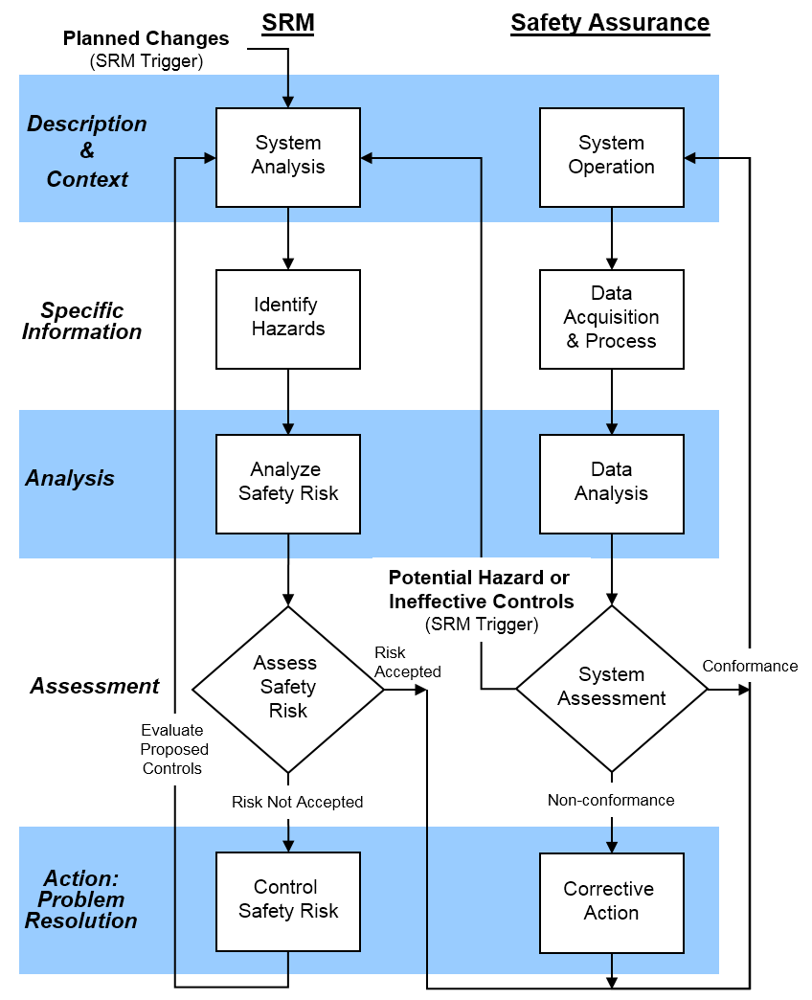

# Solid Rocket Motor(SRM) Safety

## Overview

This directory shall outline our Safety Management System(SMS) when it comes to designing and implementing our SRM, and set in place guidelines when it comes to careful, precise and accurate handling of equipment & chemicals, as well as their storage and disposal, used in crafting.

## What is a Safety Management System(SMS) and why is it necessary?

An SMS is, basically, a safety net when things go according to [Murphy's Law](https://en.wikipedia.org/wiki/Murphy%27s_law). It's mostly used in Aviation and other critical systems like what we're building here at Nakuja. This is paramount and will save us a lot in terms of damages and catastrophic failures.  This sums it up.

There are 4 pillars of an SMS, in our case:

1. **Safety Policy**: The guiding principle and safety strategy.
2. **Safety Risk Management**[^1]: The description, identification, assessment, analysis and control of the risk.
3. **Safety Assurance**: Informing the team of the strategy and encouraging its implementation
4. **Safety Promotion**: The guiding principle and safety strategy

[^1]: SRM stands for Solid Rocket Motor. It might be confused with this, but for future references: ***Always countercheck your abbreviations and acronyms!***

## Just what I thought you should know:

## References

- [National Environment Management Authority of Kenya(NEMA)](https://www.nema.go.ke/images/Docs/Regulations/FinalChemicalsRegulationJune%202013_1.pdf)
- [SRM Institute of Science and Technology, India](https://webstor.srmist.edu.in/web_assets/downloads/2023/chemical-and-hazardous-waste.pdf)
- [US Federal Aviation Administration(FAA)](https://www.faa.gov/about/initiatives/sms/explained/components)
